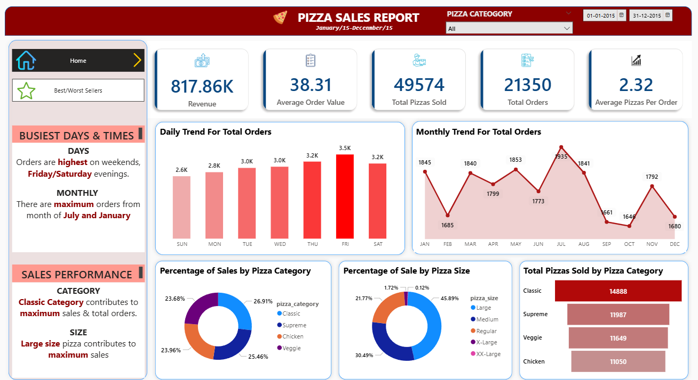
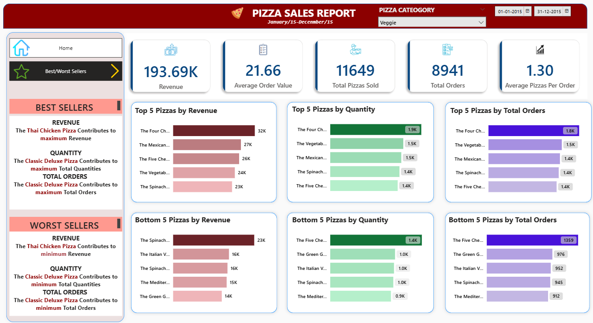

# 🍕 Pizza Sales Analytics – SQL & Power BI



An end-to-end data analytics project that analyzes one year of pizza outlet sales using **Microsoft SQL Server** and **Power BI**.  
The project transforms raw transactional data into validated business insights and delivers an interactive executive dashboard to support data-driven decision-making.

---

## 📌 Project Overview

This project analyzes pizza sales data for a full calendar year to understand revenue performance, demand patterns, and product-level trends.  
Raw transaction data is processed and analyzed using SQL, then modeled and visualized in Power BI to create an interactive, stakeholder-friendly dashboard.

**Objective:**  
Enable a pizza restaurant to evaluate overall performance, identify high- and low-performing products, and uncover temporal and categorical sales patterns.

---

## 🎯 Business Goals

- Quantify overall business performance using core KPIs such as revenue, orders, and units sold.
- Identify daily and monthly order trends to understand busy periods and seasonality.
- Analyze sales contribution by pizza category and size to support pricing and product strategy.
- Identify best- and worst-selling pizzas to guide marketing, promotions, or menu optimization.

---

## 🛠️ Tech Stack

- **Microsoft SQL Server** – Relational database for storing and querying sales data  
- **SQL Server Management Studio (SSMS)** – Data import, querying, and KPI logic  
- **Power BI Desktop** – Data modeling, DAX measures, and dashboard design  
- **Microsoft Excel** – Initial inspection and validation of the raw CSV dataset  

---

## 📂 Dataset

The dataset consists of a single CSV file containing pizza sales transactions for the year **2015**, with approximately **48,000 rows** and **12 columns**.  
Each row represents a pizza item sold within an order.

### Key Columns

- **pizza_id** – Unique identifier for each pizza sold (row-level granularity)
- **order_id** – Identifier for customer orders (repeated for multi-pizza orders)
- **pizza_name_id** – Encoded identifier for pizza type
- **pizza_name** – Descriptive pizza name
- **quantity** – Number of pizzas sold in the row
- **order_date** – Order date
- **order_time** – Order time (used for busiest-time analysis)
- **unit_price** – Price per pizza unit
- **total_price** – Line-level revenue
- **pizza_size** – Pizza size (e.g., Regular, Medium, Large, XL, XXL)
- **pizza_category** – Pizza category (Classic, Supreme, Veggie, Chicken)
- **pizza_ingredients** – Toppings and ingredients

---

## 🧮 SQL Layer – KPIs & Analytics

The CSV file is imported into SQL Server as a flat table within a dedicated database (`PizzaDB`).  
All KPI calculations and analytical queries are implemented in SQL to establish a reliable source of truth before visualization.

### Core KPIs

- **Total Revenue**  
  *Sum of total_price across all transactions*

- **Average Order Value (AOV)**  
```
Average Order Value (AOV) = Total Revenue / Total Number of Orders
````

- **Total Pizzas Sold**  
*Sum of quantity across all rows*

- **Total Orders**  
*Count of distinct order_id values*

- **Average Pizzas per Order**  
```
Average Pizzas per Order = Total Pizzas Sold / Total Number of Orders
```


---

### Trend & Distribution Analysis (SQL)

SQL queries are used to answer the following analytical requirements:

- Daily trend of total orders
- Monthly trend of order volume
- Percentage of sales by pizza category
- Percentage of sales by pizza size
- Total pizzas sold by category
- Top 5 best-selling pizzas by:
- Revenue
- Quantity sold
- Total orders
- Bottom 5 worst-selling pizzas across the same measures

These SQL outputs are later validated against Power BI measures to ensure consistency.

---

## 📊 Power BI Layer – Data Model & Measures

Power BI connects directly to the SQL Server database as the primary data source.

### Data Cleaning (Power Query)

In Power Query, the data is prepared through:

- Data type validation for dates, times, numeric, and text fields
- Column renaming and formatting
- Text transformations (e.g., month name formatting)
- Creation of helper columns to support slicers and visuals

---

### Data Processing (DAX)

DAX measures are created to:

- Reproduce all core KPIs within Power BI
- Support trend analysis (day, month, weekday)
- Enable conditional formatting and KPI cards
- Drive interactive behavior across report pages

---

## 📈 Dashboard Design

The final report consists of **two interactive Power BI pages**, designed for executive-level consumption.

---

## 1️⃣ Sales Overview Dashboard

This page provides a high-level snapshot of business performance and key trends.

### Key Components

- **KPI Cards**
- Total Revenue
- Average Order Value
- Total Pizzas Sold
- Total Orders
- Average Pizzas per Order

- **Daily Orders Trend**
- Column chart highlighting order volume by day

- **Monthly Orders Trend**
- Line chart showing seasonality and peak months

- **Sales by Pizza Category**
- Donut chart displaying revenue contribution

- **Sales by Pizza Size**
- Donut/Pie chart showing size preferences

- **Total Pizzas Sold by Category**
- Funnel chart for volume comparison

- **Insight Text Boxes**
- Concise business takeaways placed near visuals

- **Interactive Filters**
- Pizza category slicer
- Date range slicer
- Cross-filtering via chart interactions

### Screenshots


## 2️⃣ Best & Worst Sellers Dashboard

This page focuses on **product-level performance**, highlighting both high-performing and underperforming pizzas to support strategic decision-making.

### Key Components

#### Shared KPI Section
- Repeats core KPIs from the overview page to maintain business context while analyzing individual products.

#### Top 5 Best Sellers
- Ranked by **Revenue**
- Ranked by **Quantity Sold**
- Ranked by **Total Orders**

These views help identify pizzas that drive the most value and customer demand.

#### Bottom 5 Worst Sellers
- Identifies underperforming pizzas based on:
  - Revenue
  - Quantity sold
  - Total orders

This analysis supports decisions around promotions, pricing adjustments, or menu optimization.

#### Insight Section
- Highlights concise, actionable observations derived from the visuals.
- Designed to guide stakeholders on potential marketing actions or product rationalization.

#### Category Filter
- Allows focused analysis by pizza category.
- Recomputes top and bottom sellers dynamically based on the selected category.

#### Navigation Buttons
- Enables seamless navigation between report pages.
- Includes a visual indicator (such as color or arrow) to show the active page.

### Screenshots



## ❓ Business Questions Answered

- What is the total revenue, order count, and pizza volume over the analysis period?
- How do orders vary by day and by month?
- Which pizza categories and sizes generate the highest revenue?
- Which pizzas are top performers and which are underperforming?
- What are the busiest days and time windows for customer orders?

---

## ✅ Key Takeaways

- Demonstrates an end-to-end analytics workflow from raw data to insights.
- Combines SQL-based analysis and validation with Power BI data modeling.
- Focuses on business-driven insights rather than tool-only usage.
- Designed for portfolio presentation and technical interview discussion.

---
## 🛡️ License
This project is licensed under the **[MIT License](https://opensource.org/licenses/MIT)**.  
You are free to use, modify, and share this project with proper attribution.

---

## 🌟 About Me
Hi there! I’m **Pranshul Sharma**, a **B.Tech student in Information Technology** and a **Data Analyst enthusiast** on a mission to build a strong career in data analytics. I am passionate about transforming raw data into meaningful insights using **SQL, Python, and data visualization tools**.

I enjoy working on real-world datasets, exploring patterns, and presenting insights that support data-driven decision-making. Through continuous learning and hands-on projects, I am actively developing my skills in **data analysis, business intelligence, and analytical storytelling**, with the goal of becoming a proficient and impactful **Data Analyst**.
